# write all files inside in the following pattern

write all the document inside /Users/gustavo/deliver/project-doc  in the following pattern TECH-XXXX and write business-logic.md, qa.md, implementation.md 

# Personal Feature Workflow

Follow this workflow for every implementation task unless the user explicitly says otherwise. Approval must be explicit: silence, inactivity, or an unrelated reply is never approval. Approval of a document does not automatically approve starting a task or committing its changes.

## Language

- Private, local-only Markdown documentation and other artifacts that will not be committed or seen by colleagues may be written in Portuguese. This includes `business-logic.md`, `code-sequence.md`, `implementation.md`, `qa.md`, and `review.md` when they remain local planning files.
- Write everything that will be committed, published, or shared with colleagues in English. This includes source code, identifiers, code comments, tests, logs, user-facing technical text, tracked documentation, branch names, commit messages, pull requests, and team-facing review notes.
- Follow an explicit localization requirement or repository convention when it requires another language.
- Conversation with the user may follow the language used by the user.

## Code comments

- Keep code comments to the minimum necessary. Prefer clear names, small functions, and straightforward structure over explanatory comments.
- Add a comment only when it explains a non-obvious reason, invariant, external constraint, compatibility requirement, security or performance tradeoff, or temporary workaround that the code cannot express clearly.
- Do not add comments that restate the code, narrate simple control flow, describe obvious types or assignments, mark sections, or explain what was changed during the task.
- Keep comments to one line in most cases. Use a multi-line comment only when a genuinely complex constraint cannot be explained accurately in one line.
- Preserve required license notices, generated-code markers, public API documentation, and comments required by repository conventions or tooling.
- Before presenting a task for approval, review newly added comments and remove any that do not add essential context.

## Workflow overview

```mermaid
flowchart TD
    A[Start feature] --> B[Inspect repository and synchronize verified base]
    B --> C[Create business-logic.md]
    C --> C1{Approved?}
    C1 -- No --> C
    C1 -- Yes --> D[Create code-sequence.md]
    D --> D1{Approved?}
    D1 -- No --> D
    D1 -- Yes --> E[Create implementation.md]
    E --> E1{Approved?}
    E1 -- No --> E
    E1 -- Yes --> F[Create qa.md with subagent]
    F --> F1{Approved?}
    F1 -- No --> F
    F1 -- Yes --> G[Create feature branch from verified base]
    G --> H[Present next task]
    H --> H1{Task approved?}
    H1 -- No --> H
    H1 -- Yes --> I[Red: demonstrate failing test]
    I --> J[Green: minimal implementation]
    J --> K[Refactor and verify]
    K --> L[Show diff and test summary]
    L --> L1{Commit approved?}
    L1 -- No --> L
    L1 -- Yes --> M[Commit approved code and tests]
    M --> N{More tasks?}
    N -- Yes --> H
    N -- No --> O[Run required checks]
    O --> P[Run four scoped review subagents]
    P --> Q[Consolidate top 10 findings]
    Q --> R[Create or update review.md]
    R --> R1{review.md approved?}
    R1 -- No --> R
    R1 -- Yes --> S{Corrections approved?}
    S -- Yes --> T[Add correction task to implementation.md]
    T --> H
    S -- No --> U{Manual QA scope changed?}
    U -- Yes --> V[Update qa.md]
    V --> V1{qa.md approved?}
    V1 -- No --> V
    V1 -- Yes --> W[Complete feature]
    U -- No --> W
```

## Start of execution — once per feature

Run this section once at the beginning of the feature. Do not repeat it before individual tasks, commits, or reviews, or when resuming the same feature after an approval pause.

1. Read repository instructions and inspect the current branch, working tree, worktrees, configured remote/upstream, and actual default/base branch. Use the user's requested base when specified; otherwise discover the default branch rather than assuming `main`.
2. Preserve all pre-existing changes, including staged and untracked files. Never stash, discard, reset, overwrite, or commit unrelated work without explicit approval. If switching branches could overwrite, mix, or hide existing changes, stop and ask how to proceed.
3. For a normal checkout with an accessible remote, switch to the base branch, fetch its remote, and update it using fast-forward only (for example, `git merge --ff-only <verified-upstream>` after fetching). Never create an automatic merge commit, rebase, or reset. A locally ahead branch is not identical to the remote even if fast-forward reports no update.
4. If the upstream is ambiguous, the base is ahead of or diverged from its remote, the remote is unavailable, or the repository has no remote, report the condition and obtain direction before treating the base as synchronized.
5. In a managed worktree, inspect its assigned branch and base first. If the base is checked out elsewhere or switching conflicts with the worktree setup, report the constraint and obtain direction instead of modifying another checkout.
6. Report the base branch, whether it was already current, a concise summary of incoming commits, and any divergence. Record the verified base commit SHA for the feature.
7. Begin the documentation pipeline from that verified base state.

## Documentation pipeline — before any code

Create these files in the project root in the exact order below. Each file must stay at or below 250 lines. Prefer short sections over essays. Inspect existing files before editing them and preserve unrelated content; ask if they belong to another feature.

After each file, present it and stop for approval before drafting the next. Do not create or change production or test code during this pipeline.

1. `business-logic.md`
   - Explain current and desired behavior, who is affected, acceptance criteria, edge cases, impact, risks, what stays the same, and what is out of scope.
   - No code or implementation details.
2. `code-sequence.md`
   - Describe where work lands and the end-to-end runtime path, including layers, modules, services, and integrations touched.
   - Include a Mermaid sequence diagram showing the complete flow.
   - No implementation code.
3. `implementation.md`
   - List small, ordered TDD tasks with checkboxes, verification steps, and completion criteria.
   - For each task, identify the failing test and exact files to create, edit, and not touch.
   - Record the verified base branch and commit SHA.
   - If additional files or a scope change become necessary, update the plan and obtain approval before touching those files or implementing the change.
4. `qa.md`
   - Use an independent subagent to draft manual tests from the approved documents.
   - Checklist only: setup, actions, and expected results, including relevant edge cases and regressions.
   - Specify local, QA, or both according to the project. Use synthetic data.
   - No production code.

Only after all four files are approved may implementation start. Keep the documents current. Material changes to approved behavior, scope, or test expectations require renewed approval of the affected documents before dependent work continues; routine checkbox updates do not require another document approval.

Never stage or commit any Markdown file (`*.md`, case-insensitive), including these four documents, unless the user explicitly overrides that rule.

## Branch gate — after document approval

- Create a dedicated feature branch from the verified base before changing production or test code. Follow the repository's branch naming convention unless the user specifies a name. If no convention exists, use `<ticket-number>-<short-kebab-case-description>` (for example, `ABC-123-fix-login-redirect`). If no ticket number is available, ask the user for it or for an alternative branch name; never invent one.
- Confirm that the local base still points to the recorded commit. If it changed, report the difference and obtain approval for the new starting point and any affected plan changes.
- After a long approval pause, fetch once before branching to check for remote base changes. Report any difference and obtain approval before incorporating it or revising the plan. Do not repeat initial synchronization before each task or review.
- Never implement or commit directly on the default branch. If resuming this feature, keep its existing branch and progress.

## Per-task approval and TDD

1. Present the next task and wait for explicit approval to start. Work on one task at a time.
2. Write or update a meaningful test and run it to demonstrate failure for the expected behavior, rather than a setup or syntax error.
3. Write the minimum implementation needed to pass and run the focused tests.
4. Optionally refactor within the approved task, then rerun affected tests. Do not weaken, skip, delete, or distort valid tests merely to make the implementation pass.
5. Run repository-required verification. If automated TDD is not meaningful for the change, explain why and obtain approval for an alternative verification approach before implementing it.
6. Stop and show a short diff summary, tests and checks run, results, and remaining risks. Report blocked or failing checks honestly.
7. Wait for explicit approval to commit that task. Approval to implement is not approval to commit.
8. Stage only the approved task's code/tests using explicit paths or hunks. Inspect the full staged diff before committing: no Markdown and no unrelated changes. If pre-existing staged work prevents an isolated commit, ask how to proceed without changing its staging automatically.
9. Commit only the approved task, update its status in `implementation.md`, and wait for approval to start the next task. A user message may explicitly approve both the commit and the next task.

## Git boundaries

- No force push, push, amend, rebase, merge, or PR creation unless explicitly requested. The initial fast-forward update described above is authorized by this workflow.
- Never reset or discard user work to make synchronization or verification succeed.
- Do not add planning files to tracked ignore rules merely to keep them out of commits.

## Final independent reviews

After all tasks and required checks pass, run four independent review subagents before calling the feature complete. Use concurrent execution or waves according to available capacity.

Give all four reviewers the same final feature commit, complete feature diff against the recorded base commit, approved documents, and repository instructions.

Scope every review to code added or changed by the current feature. Reviewers may inspect surrounding or existing code only to understand direct interactions, confirm a regression caused by the feature, or identify code the feature should reuse. Do not report unrelated pre-existing problems, review other teams' changes, we can propose opportunistic cleanup related to our changes. The duplication reviewer may reference existing code only when the feature's changed code duplicates or conflicts with it. Reviewers report findings without editing code.

1. Correctness: regressions, error handling, maintainability, and test coverage.
2. Performance: queries, scalability, resource use, and unnecessary work.
3. Security: PII, secrets, logs, input handling, authentication, authorization, and tenant boundaries.
4. Duplication: new or existing code that duplicates behavior; suggest consolidation or reuse where appropriate.

Require severity, concrete evidence, file/line references, and a suggested correction for each finding. Each reviewer must prioritize material issues over style preferences. Consolidate duplicates, rank findings by severity, confidence, and direct impact, and report no more than the 10 most important findings in total across all four reviews.

## Review approval cycle

After consolidating the four reviews, create or update `review.md` in the project root. Keep it at or below 250 lines and never stage or commit it. Include:

- the recorded base commit, reviewed feature commit, and exact diff scope;
- a concise summary of tests and repository checks, including failures or limitations;
- up to 10 prioritized findings, each with an identifier, severity, evidence, file/line references, suggested correction, disposition, and status;
- accepted risks, open decisions, and any impact on manual QA.

Present `review.md` and wait for explicit user approval. Do not fix findings, accept their disposition, or call the feature complete before that approval. The user may approve findings individually or as a group.

For approved corrections, add tasks to `implementation.md` and repeat task approval, TDD, verification, and commit approval. Follow-up reviews validate only the approved corrections and their direct effects on the feature diff; they must not expand into a new repository-wide review. Rerun the affected review areas and final repository-required checks after the last correction. Then update `review.md` with the new evidence and statuses and begin a new review approval cycle. Approval of an earlier version does not approve the revised version.

If implementation or reviews change what must be tested manually, update `qa.md` and wait for approval of that revision. Keep it uncommitted.

Report completion only when required checks have passed or their limitations have been explicitly accepted, all findings have an approved disposition, and the final versions of `review.md` and `qa.md` are explicitly approved. State verification results, any accepted risks, whether manual QA was actually executed, and the remaining uncommitted planning files.

